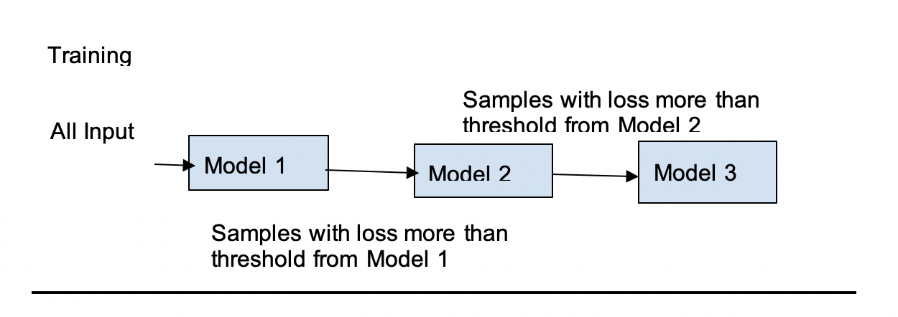
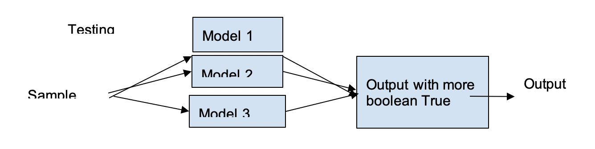
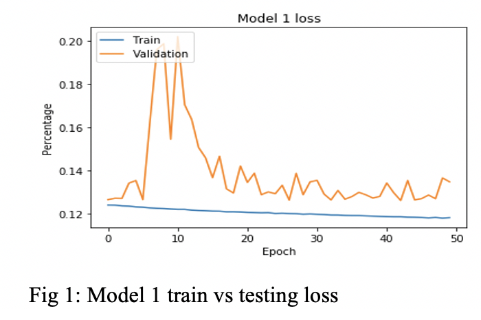
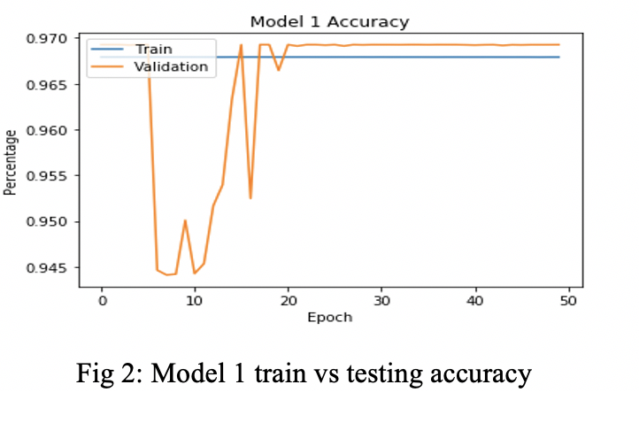

# A-Deep-Learning-Based-Cascading-Ensemble-for-Brain-Tumor-Segmentation-
Machine Learning Project
Architecture: Cascading Deep Learning Ensemble
In this project we aimed to segment brain tumors using deep learning. For our project we have created a cascading ensemble consisting of three different model. All the models are improvement of UNet architecture. All the models have one down-sample block, one bottleneck and one up-sample block.  However, within the blocks they are configured differently. We have taken the models that performed very well for our dataset. The input image size is used 512*512, as we have seen with this shape the performance is better. The configuration of three architecture is given below:
                             
The Proposed Ensemble: 
Our proposed model is sequentially trained ensemble. As we have used separate models to train sequentially, it is like cascading. The architecture of the model is built using the following procedure:   

Training Steps:

i.	Set: batch size, max epochs, loss threshold

ii.	Set train batch = train data, validation data = validation data, test data = test data

iii.	Set model = first model

iv.	Train the model batch by batch

v.	If epoch == max epoch:
     
     a.Check if batch loss > loss threshold:
         1.	Add batch id to new_batch

vi.	Set train data = new train data

vii.	Set model = next model

viii.	Set new epoch size

ix.	If last model trained
     
     a.End

x.	Else: go to step Iv

Testing Steps:
For sample in training sample:

a.	Predict the output y1, y2, y3 using model 1, model 2 and model3

b.	Choose output with greatest sum
Here, for the training and testing steps we have a number of suggestions: 

1.	Max epoch needed to be number of times till average loss has reached till the certain threshold or the model from the ensemble starts overfitting or a highest number reached. We did not add this in our procedure because we could not train each model till they overfit. 
2.	For testing or output, more sophisticated procedure can be designed.  At present we have used only the max output as max output will have maximum 1’s. However, there any type of confidence can be used and using that confidence the output can be averaged. We did not add that to our model as we could not test that.

Implementation and Performance:

Dataset Properties:
We have collected our data from Kaggle brain tumor dataset. The dataset contains of mri images with brain tumor and the mask.  There are a total of 1375 samples from 110 patients with their corresponding masks. All the sample data has tumors. 

Implementation Details:
We have implemented our model on google colab platform. Our dataset is divided into 70% for training, 15% for testing and 15% for validation.  We have trained each model for 50 epochs. Callback function is designed to track the performance for each training sample. 

Performance:
We have trained our model sequentially. First, we have trained a model, then based on the performance of the model we have selected a portion of the dataset and trained the next model. This is how our model performed:

Accuracy and Loss:
First model is trained with 963 samples.  The lass and accuracy from each epoch are plotted in the graph.  From the figure 1 we can see that, our validation loss fluctuate in between 13 to 14 at the end of the epochs but overall training loss constantly decreasing and ends in between 11 to 12. For accuracy from figure 2, we can see that training and validation accuracy settles down at the end of the epochs in between 96.5% to 97%.  This model has almost 50% of its sample with loss below 10%. Second model is trained with 500 samples for which previous models had lost more than 10%. Accuracy and loss pattern are more stable for this model, but the final result ends up within the same domain as model 1, fig 3 &4. Third model is trained with 277 samples for which previous models had loss more than 10%. ends up within the same domain as model 1 and 2 here, fig 4,5. From the graphs it is apparent that, none of the model overfitted.

 
